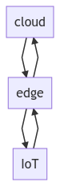
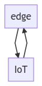
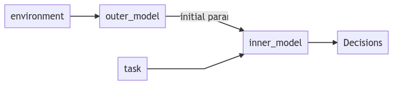

```{r setup, include=FALSE}
knitr::opts_chunk$set(echo = FALSE)
```

This is my [talk slide](https://drive.google.com/file/d/1qOdS5Y1EEVymd1C9JeoTcHkV-_yuswZq/view?usp=sharing) and [video](https://youtu.be/-d9ASUF3X74).

<a id="org6ce31e8"></a>

# Terminology

1.  What is task offloading?  
    Edge offloading migrates complex tasks from IoT devices to edge-cloud servers and it can break through the resource limitation of IoT devices.  
    -   Application Partition:  
        Divide the task into a workflow with multiple associated subtasks and offload the subtasks separately.
    -   Resource Allocation  
        Decision problems is a NP-hard problem.
2.  What is edge server? cloud server? IoT devices?  
    -   Cloud server:  
        Providing flexible and on-demand computing resources for IoT devices.
    -   Edge server:  
        Deciding which computing tasks need to be offloaded and providing a limited amount of computing resources.

  


  


<a id="orga615d88"></a>

# Problem

There are lots of factors that will effect the task offloading algorithm, e.g., failure when environment changes, slow learning speed of ML-based method.  

1.  Use Meta-learning to adjust the model for different environment.
2.  Use DRL to make the task offloading decision.


<a id="org803ecdd"></a>

# Problem formulation


<a id="orgf523dc1"></a>

## System Model


<a id="org9fd855a"></a>

### IoT device&rsquo;s workflow

$$
    R_x = \{v_1, e_{1, 2}, v_2, e_{2, 3}, \cdots\}
$$  
$v_i$ is the task $i$, and $e_{i, j}$ is the data transmission between task $v_i$ and $v_j$.  


<a id="org4f94fe3"></a>

### Decide where to execute the task

$$
b_{x, i} \in b_0, b_1, b_2
$$  
$b_0 = [1, 0, 0]^T$, $b_1 = [0, 1, 0]^T$ and $b_2 = [0, 0, 1]^T$.  


<a id="org9975fb5"></a>

### Delay (ignore the decision makeing time)

1.  Computational delay

    $$
          T_i^c = \{\begin{array}{lr}
          \frac{v_i}{C_0}, & b_{x, i} = b_0\\
          \frac{v_i}{C_1}, & b_{x, i} = b_1\\
          \frac{v_i}{C_2}, & b_{x, i} = b_2
          \end{array}
    $$  
    $C_i$ is the computing power of corresponding offload method(frequency, Hz).  

2.  Transmission delay

    $$
          T_{i, j}^t = \{\begin{array}{lr}
          0, & \text{At the same devices}\\
          \frac{e_{i, j}}{B_{0, 1}}, & \text{a devices is at IoT, the other is at edge}\\
          \frac{e_{i, j}}{B_{1, 2}}, & \text{a devices is at edge, the other is at cloud}\\
          \frac{e_{i, j}}{B_{0, 2}}, & \text{a devices is at IoT, the other is at cloud}
          \end{array}
    $$  
    $B_{i, j}$ is the bandwidth between offload devices $i$ and $j$.  

3.  Total delay

    $$
    T_x = \sum_{i = 1}^N(T_i^c + T_{i, i+1}^t)
    $$  


<a id="orge254a84"></a>

### Energy consumption (ignore task transmission)

A energy consumption is:  
$$
E = E_{IoT} + \alpha E_{edge} + \beta E_{cloud}
$$  
for a IoT device $x$, it&rsquo;s energy consumption is:  
$$
E_x = \sum_{i=1}^N [E_{i, IoT}, E_{i, edge}, E_{i, cloud}]b_{x, i}
$$  


<a id="org2450d34"></a>

## Problem

$$
\min_b Q(x, b) = \sum_{x=1}^M (T_x + \delta E_x)
$$  


<a id="orgb4eb3fc"></a>

# Method


  


<a id="orgabdfe28"></a>

## Inner Model

  
This is a live training method. Once we have the input of workflow, environment and meta initial parameter, we train the model and find the best decision. We use parallel $s$ RL DNNs to generate the next action respected to the input states and then calculate the rewards then store the state, actions and reward into memory. If we add enough data into memory(add 5+ datas), we sample a state vector and use it to train our RL DNN model. Once this whole process have iterate over a while, we use this DNN model to make the decision.  


<a id="org5c13b9c"></a>

### Local objective function (reward of each parallel $s$ DNNs output actions)

$$
F(S_i, a) = T_i^c + T_{i, i+1}^t+\delta E_i
$$  
The delay of this moment plus the energy consumption.  


<a id="org138e9ac"></a>

### Find the best action from $s$ parallel DNN output

The optimal solution is the action with the lowest $F$.  


<a id="org4694e70"></a>

### Reward

If the action is the optimal solution, the reward is the negative value of the minimum $F$.  
If the action is NOT the optimal solution, the reward is the negative value of the maximum $F$.  


<a id="orgb3342d3"></a>

## Outer Model

We random sample a environment from the memory pool, and calculate the action, reward and the next states, then store the state, actions and reward into memory pool. If we add enough data into memory(add 5+ datas), we sample a state vector and use it to train our RL DNN model. Once this whole process have iterate over a while, we use this DNN model parameter as the meta parameter for inner model.  


<a id="org31a2897"></a>

# Related work


<a id="orgc24abd1"></a>

## Traditional

The method obtain results after multiple iterations and often involve too many complex calculation operations:  

-   Markov processes
-   queue models

Heuristic algorithms, but it need large amount of computation, which results in high runtime cost:  

-   COM
-   genetic algorithm by Goudarzi.


<a id="org81b3f85"></a>

## Intelligent with AI

Use DL to classify the final offloading position of the input task information.  

-   Parallel and distributed DNNs.

Use RL, but slow training  

-   Actor-Critic
-   DQN


